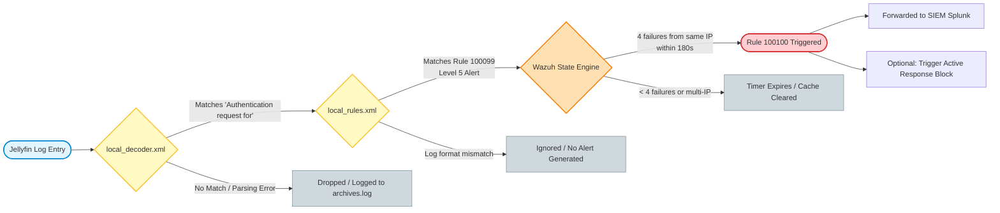

# Project-NEXUS: Unified-Threat-Intelligence-Automated-IDPS
An ISO/SAE 21434-aligned SIEM/SOAR infrastructure using Wazuh, Splunk, and ChatOps automation.

## SecOps Automated Detection & Mitigation Pipeline

## Introduction
As self-hosted infrastructure components become central points of entry for home and enterprise networks, secure web-facing applications like the Jellyfin Home Media Server face constant exposure to external security threats. Among these vectors, automated dictionary and brute-force attacks represent a highly prevalent method used by malicious actors to compromise user accounts and gain unauthorized access to underlying server resources.

To mitigate this risk, this use case implements an automated, real-time threat detection and log analysis pipeline using **Wazuh SIEM/XDR** and **Splunk**. By continuously parsing Jellyfin application logs, extracting critical indicators of compromise (IoCs), and utilizing state-engine rule correlation, the architecture successfully identifies rapid authentication failures originating from a single source network address. 

The primary objective of this documentation is to outline the deployment, verification, and analysis of this custom security wrapper, detailing how raw authentication failures are captured, structured into normalized security events, and forwarded to a centralized security operations environment for administrative triage and response.

---

# Use Case 1: Brute Force Detection

## Attack Scenario 
An external or internal threat actor attempts to gain unauthorized access to web-hosted resources—specifically a self-hosted `Jellyfin - Home Media Server`—utilizing automated dictionary or brute-force attack vectors.

## Detection Mechanism Pipeline
The flowchart below maps the end-to-end telemetry lifecycle, tracking how a raw Jellyfin log entry traverses custom decoders, evaluates against the state engine, and handles parsing failures or successful SIEM alerts.



### Pipeline Breakdown 
*   **Log Ingestion:** The Wazuh agent continuously monitors the Jellyfin server log destination (e.g., `/var/log/jellyfin/jellyfin.log` or systemd-journald) for real-time tracking of login activity.
*   **Threshold Evaluation:** When a threshold of consecutive failed login attempts is breached within a specific time window, the Wazuh state engine correlates the activity and fires Rule 100100.
*   **Alert Generation:** Wazuh converts the matched rule condition into a structured security alert event containing the source IP (`srcip`), targeted username (`dstuser`), and timestamp metadata.
*   **Forwarding:** The manager streams this alert event in real-time to Splunk via forwarder or API for centralized log management and retention.
*   **Wazuh Search Query (WSR):** A specific syntax or query filter used within the Wazuh dashboard to quickly isolate, verify, and retrieve these exact log occurrences during threat hunting.

---

## Technical Configuration

### 1. Custom Rules
> **File Path:** `/var/ossec/etc/rules/local_rules.xml`

```xml
<group name="jellyfin">
  <rule id="100099" level="5">
    <decoded_as>jellyfin</decoded_as>
    <description>Jellyfin login failure for user $(dstuser)</description>
    <group>authentication_failed</group>
  </rule>

  <rule id="100100" level="10" frequency="4" timeframe="180">
    <if_matched_sid>100099</if_matched_sid>
    <same_source_ip />
    <description>Jellyfin: Brute-force attack detected from $(srcip)</description>
    <group>authentication_failed,brute_force</group>
  </rule>
</group>
```

### 2. Custom Decoders
> **File Path:** `/var/ossec/etc/decoders/local_decoder.xml`

```xml
<decoder name="jellyfin">
  <prematch>Authentication request for </prematch>
</decoder>

<decoder name="jellyfin_fields">
  <parent>jellyfin</parent>
  <regex>Authentication request for "(\S+)" has been denied \(IP: "(\S+)"\)</regex>
  <order>dstuser, srcip</order>
</decoder>
```

---

## Validation and Verification

To ensure parsing accuracy and prevent configuration errors from causing service disruptions, a two-phase validation strategy was executed on the Wazuh manager prior to production deployment.

### Phase 1: Configuration Sanity Checks
Before restarting the live engine, the custom rulesets and decoders were compiled in test-only mode using the `-t` flag. This ensures that file updates do not contain configuration syntax errors that could crash the manager daemon.

*   **Rule Engine Compilation Check:**
    ```bash
    sudo /var/ossec/bin/wazuh-analysisd -t
    ```
    *Purpose:* Validates configuration settings, rule schemas, and decoder logic layout.

*   **Log Testing Utility Validation:**
    ```bash
    sudo /var/ossec/bin/wazuh-logtest -t
    ```
    *Purpose:* Confirms the analytical sub-engine is ready and syntactically sound.

### Phase 2: Log Stream Simulation & Behavioral Testing
To verify that the custom regex patterns accurately isolate fields and increment the correlation counter, the interactive `wazuh-logtest` utility was used to replay historic attack logs.

```bash
sudo /var/ossec/bin/wazuh-logtest
```

During simulation testing, standard network log headers were pre-pended to mimic incoming server traffic streams over UDP:

```text
Jul 31 23:25:00 DELLBOX 10.21.121.67:55526 10.21.189.78:514 UDP Authentication request for "admin" has been denied (IP: "192.168.1.150")
```

### Verification Benchmarks
By feeding these raw test events into the interactive terminal session, three key operational parameters were successfully confirmed:
1. **Decoder Matching:** The root decoder successfully triggers on the `<prematch>` string `Authentication request for `.
2. **Field Extraction:** The child decoder (`jellyfin_fields`) cleanly isolates variables into distinct structured keys (`dstuser="admin"`, `srcip="192.168.1.150"`).
3. **Rule Execution:** The logic transitions cleanly from single-failure logging (Rule `100099`) into full brute-force alert aggregation (Rule `100100`).

---

## Splunk Analytics & Threat Hunting Queries (SPL)

### Incident Triage View
Isolates all security events generated when the threshold-based brute force alert triggers.

```splunk
index=wazuh rule.id=100100
| table _time, srcip, dstuser, rule.description, rule.level
| sort - _time
```

### Top Attacker IP Address Profiles
Aggregates attacks to pinpoint the most aggressive offending source nodes attempting intrusion.

```splunk
index=wazuh rule.id=100100
| stats count BY srcip
| rename srcip AS "Attacker IP", count AS "Total Brute Force Alerts"
| sort - "Total Brute Force Alerts"
```
> **Actual SIEM Output - Top Attacker IP Analysis:** 
