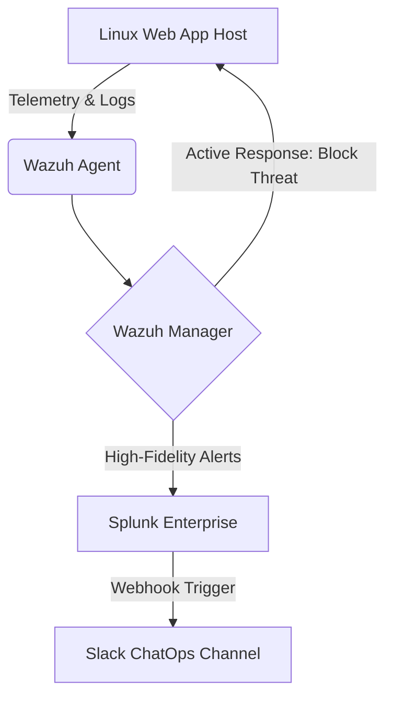

# Project-NEXUS: Unified-Threat-Intelligence-Automated-IDPS
An ISO/SAE 21434-aligned SIEM/SOAR infrastructure using Wazuh, Splunk, and ChatOps automation.

# SecOps Automated Detection & Mitigation Pipeline

## Project Overview
This project documents the design and implementation of a centralized Security Operations (SecOps) pipeline built to monitor, detect, and mitigate active threats against a self-hosted web application. By pairing Wazuh (Endpoint Detection & Response / SIEM) with Splunk (Advanced Log Analytics) and Slack (ChatOps / Notification Layer), this architecture establishes a resilient defense loop capable of executing automated, active responses against real-world attack vectors.

*   **Telemetry Generation:** Wazuh agents deployed on the web application host collect log data, file integrity metrics, and system telemetry.
*   **Detection & Active Mitigation:** The Wazuh Manager processes events against security rulesets. When malicious activity triggers a critical rule, Wazuh executes an Active Response script locally to block the threat instantly.
*   **Deep Analytics:** Filtered, high-fidelity security alerts are forwarded from Wazuh to Splunk for long-term retention, complex correlation, and visual dashboarding.
*   **ChatOps Notification:** Splunk passes live, critical events directly to a dedicated Slack channel via incoming webhooks, keeping the administrator informed in real time.

## Technology Stack

*   **SIEM / EDR Engine:** Wazuh (Manager & Agents)
*   **Log Aggregation & Analytics:** Splunk Enterprise / Splunk Universal Forwarder
*   **Orchestration / Alerting Layer:** Webhooks (Slack ChatOps)
*   **Target Environment:** Linux-based Web Application Hosting Environment

##  Intial Setup
*    **Hardware:** Intel(R) Core(TM) i7-6920HQ CPU @ 2.90GHz
*    **Platform OS:** Ubuntu 22.04.5 LTS (Jammy Jellyfish)
*    **Wazuh:** WAZUH_VERSION="v4.14.5", WAZUH_REVISION="rc1"
*    **Wazuh agents a.k.a Telemetry Endpoint:** There were few devices in my home network identifed as good candidates for the endpoints:

  
##

  

##

``Threat Mitigation Scenarios Demonstrated``
