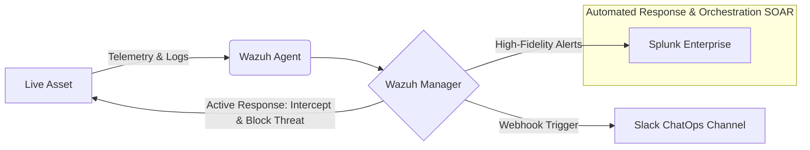

# Project-NEXUS: Unified-Threat-Intelligence-Automated-IDPS
An ISO/SAE 21434-aligned SIEM/SOAR infrastructure using Wazuh, Splunk, and ChatOps automation.

# SecOps Automated Detection & Mitigation Pipeline

## Project Overview
This project documents the design and implementation of a centralized Security Operations (SecOps) pipeline built to monitor, detect, and mitigate active threats against a self-hosted web application. By pairing Wazuh (Endpoint Detection & Response / SIEM) with Splunk (Advanced Log Analytics) and Slack (ChatOps / Notification Layer), this architecture establishes a resilient defense loop capable of executing automated, active responses against real-world attack vectors.


*   **Telemetry Generation:** Wazuh agents deployed on the web application host collect log data, file integrity metrics, and system telemetry.
*   **Detection & Active Mitigation:** The Wazuh Manager processes events against security rulesets. When malicious activity triggers a critical rule, Wazuh executes an Active Response script locally to block the threat instantly.
*   **Deep Analytics:** Filtered, high-fidelity security alerts are forwarded from Wazuh to Splunk for long-term retention, complex correlation, and visual dashboarding.
*   **ChatOps Notification:** Splunk passes live, critical events directly to a dedicated Slack channel via incoming webhooks, keeping the administrator informed in real time.

## Technology Stack

*   **SIEM / EDR Engine:** ```Wazuh (Manager & Agents)```    https://documentation.wazuh.com/current/getting-started/index.html
*   **Log Aggregation & Analytics:** ```Splunk Enterprise / Splunk Universal Forwarder (activated accounted arequired with Splunk support team)```    https://www.splunk.com/ 
*   **Orchestration / Alerting Layer:** ```Webhooks (Slack ChatOps) (Github)```    https://github.com/wazuh
*   **Target Environment:** ```Linux-based Web Application Hosting Environment```    https://releases.ubuntu.com/jammy/


##  Intial Setup

  

##
*    **Hardware:** ```Intel(R) Core(TM) i7-6920HQ CPU @ 2.90GHz```
*    **Platform OS:** ```Ubuntu 22.04.5 LTS (Jammy Jellyfish)```
*    **Wazuh:** ```WAZUH_VERSION="v4.14.5", WAZUH_REVISION="rc1"```
*    **Wazuh agents a.k.a Telemetry Endpoint:** ```There were few devices in my home network identifed as good candidates for the endpoints```


  
###  Wazuh Dashboard


##  Extended Setup
Landing on the Wazuh Dashboard was flawless, thanks to the excellent documentation provided by Wazuh. I was able to see the telemetry projected in the Wazuh server, with the built-in, rule-based assessment consolidated under the Wazuh dashboard.

Now I wanted to take this setup to next level where more devices/ resources will be added to the endpoint telemetry with Integration with Splunk.

*    **Orchestration/ SOAR Platform:** ```Splunk Enterprise, Version: 10.4.1 (trial version)```
*    **Web Resources:** ```Self hosted websites with Cloudflared reverse proxy (SSL/TLS supported)```
*    **DMZ Server:** ```Exposing the home network to the Internet
*    **Alerting Layer:** ```Slack integration using webhooks``` https://slack.com/
*    **Telemetry Endponits:** ```Identified additonal endpoints for better log aggregation```

##    Network Topology for my homelab


##    Incident Detection Workflow




``Threat Mitigation Scenarios Demonstrated``

<!-- Replace 'your-username' with your actual GitHub profile name -->

[](https://github.com/deeprooter)
