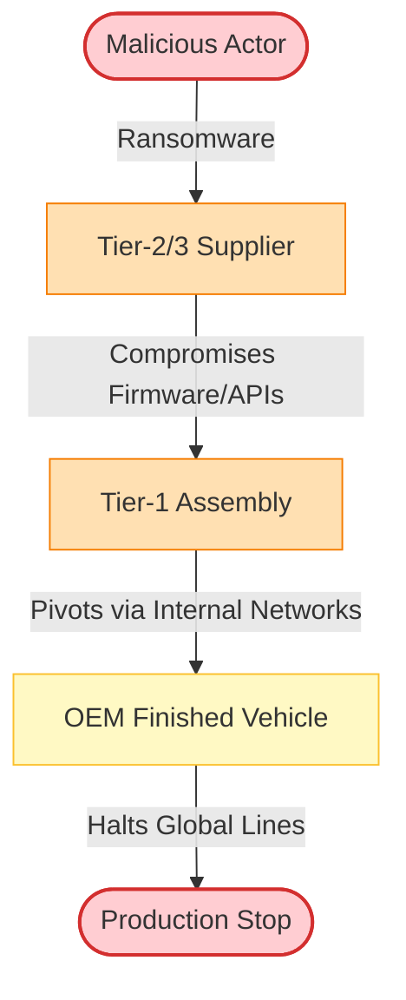

# Project-NEXUS: Unified Threat Intelligence & Automated IDPS
An ISO/SAE 21434-aligned SIEM/SOAR infrastructure deploying automated detection, deep data analytics, and real-time ChatOps mitigation loops using Wazuh, Splunk, and Slack automation.

# SecOps Automated Detection & Mitigation Pipeline

## Project Overview
This project documents the design and implementation of a centralized Security Operations (SecOps) pipeline built to monitor, detect, and mitigate active threats against a self-hosted web application. By pairing Wazuh (Endpoint Detection & Response / SIEM) with Splunk (Advanced Log Analytics) and Slack (ChatOps / Notification Layer), this architecture establishes a resilient defense loop capable of executing automated, active responses against real-world attack vectors.

---

## Introduction
Modern enterprise networks and self-hosted environments face an expanding perimeter of web-facing exposures. Automated brute-force arrays, vulnerability scanning engines, and dictionary-based exploit frameworks constantly search for perimeter vulnerabilities. Traditional passive logging infrastructures lack the agility required to counter these immediate, high-frequency intrusion threats.

Project-NEXUS bridges this operational gap by deploying a resilient, multi-tiered Intrusion Detection and Prevention System (IDPS). By integrating endpoint detection tools with big-data analytics and collaborative workspace triggers, Project-NEXUS transitions a standard network architecture from a defensive posture into an active, self-healing defensive ecosystem.

### Core Objectives
*   **Real-Time Telemetry Processing:** Continuously monitor systems to capture indicators of compromise (IoCs) and application failure streams.
*   **Automated Edge Mitigation:** Execute sub-second local active responses to block source attackers at the network firewall layer.
*   **Centralized Security Analytics:** Aggregate high-fidelity security data for deep search analytics, multi-vector correlation, and visual dashboard metrics.
*   **ChatOps Operational Visibility:** Stream security alarms to administrators over messaging channels to streamline incident assessment and response workflows.

---

## Project Structure & Architecture
This repository is organized into distinct functional phases to simplify deployment, verification, and engineering audits. Use the links below to navigate deeper technical implementations:

```text
├── README.md                           # Master Project Introduction & Architecture Overview
├── CONFIGURATION-AND-SETUP.md           # Part 1: Architecture, Installation, & Network Topology
└── DETECTION-AND-RESPONSE.md           # Part 2: Use Cases, Decoders, Validation, & SIEM Analytics
```

### 1. Project Implementation Framework
*   **System Architecture:** High-level blueprint mapping data streams from localized bare-metal servers, hypervisors, and Docker nodes to a dedicated ingestion pipeline.
*   **Technology Stack:** Core infrastructure specifications highlighting platform deployments on Ubuntu Server, Wazuh XDR managers, Splunk Enterprise indices, and secure Cloudflare reverse-proxy tunnels.
*   **Homelab Network Topology:** A comprehensive network diagram illustrating boundaries between demilitarized zones (DMZ), internal VLAN nodes, and the security management plane.

### 2. Detection & Response Playbooks
*   **Custom Parsing Rulesets:** Production XML decoders engineered to capture and tokenize application authentication faults in real time.
*   **Automated Security Workflows:** Mermaid sequence diagrams outlining the lifecycle of an alert—from initial edge log ingestion to state-engine correlation and Active Response firewall remediation.
*   **SIEM Analytics Integration:** Advanced Splunk Search Processing Language (SPL) threat hunting queries designed for behavioral tracing and statistical attacker profiling.
*   **ChatOps Orchestration Layer:** Native webhook structures funneling high-priority threat alerts directly into dedicated Slack and GitHub channels.


# Why Project-NEXUS Matters

Project-NEXUS goes beyond basic log tracking to fix real-world gaps in everyday security operations.

> ## Passive Logging vs. Active "Muscle Memory"
Most SIEM platforms just watch and log breaches. Project-NEXUS closes this gap: **Wazuh acts as the nervous system** to spot threats, while **automated scripts act as muscle memory** to block firewalls instantly. This cuts attacker dwell time from hours to milliseconds.

> ## Smart Filtering to Fight Alert Fatigue
Streaming millions of raw logs into Splunk creates massive noise and drives up ingestion costs. Project-NEXUS uses tiered telemetry to filter data smarter:
*   Wazuh handles the heavy lifting at the edge, condensing raw logs into clean alarms.
*   Only critical, high-fidelity security events pass to Splunk, saving licensing fees and keeping queries fast.

> ## Real-Time Security Context via ChatOps
By routing alert hooks straight into Slack, the project loops in everyone—from developers to infrastructure engineers. Vital incident details like the target account (`dstuser`) and attacker IP (`srcip`) drop right into chat, removing the need to dig through consoles during an emergency.

---

# The Supply Chain Blindspot: Why Suppliers Need SIEM/SOAR

Many assume only major automotive OEMs like Ford or BMW need heavy threat-hunting architectures. In reality, **Tier 1, 2, and 3 suppliers are now the primary targets** for modern attackers.


```mermaid
graph TD
    A([Malicious Actor]) -->|Ransomware| B[Tier-2/3 Supplier]
    B -->|Compromises Firmware/APIs| C[Tier-1 Assembly]
    C -->|Pivots via Internal Networks| D[OEM Finished Vehicle]
    D -->|Halts Global Lines| E([Production Stop])

    style A fill:#ffcdd2,stroke:#d32f2f,stroke-width:2px
    style B fill:#ffe0b2,stroke:#f57c00,stroke-width:1px
    style C fill:#ffe0b2,stroke:#f57c00,stroke-width:1px
    style D fill:#fff9c4,stroke:#fbc02d,stroke-width:1px
    style E fill:#ffcdd2,stroke:#d32f2f,stroke-width:2px
```

> ## The "Trusted Pivot" Risk
Attackers know OEMs are hard to breach directly, so they target smaller contractors with weaker defenses.
*   **The Vector:** Suppliers often hold trusted VPNs, RDP access, or shared APIs connected to the OEM. Compromising a supplier's engineering file server lets attackers pivot straight into the OEM’s main network.
*   **Real-World Impact:** Recent extortion campaigns successfully exfiltrated confidential EV blueprints belonging to global auto manufacturers by breaching their component suppliers rather than the OEMs themselves.

> ## Just-In-Time Logistics Mean Zero Downtime Tolerance
Automotive manufacturing relies on tight, parts-on-demand schedules. If a regional supplier halts microchip shipments due to ransomware, the downstream OEM assembly line can ground to a halt within hours. Because of this massive leverage, cybercriminals frequently target suppliers to demand massive payouts.

> ## Compliance and Legislation Are No Longer Optional
Global regulations now force the entire automotive supply chain to secure its hardware and software.

| Legislation / Framework | Strict Supply Chain Impact |
| :--- | :--- |
| **UN Regulation No. 155** | Mandated by the UNECE. OEMs must prove they monitor cyber risks **across their entire supply chain**. OEMs now routinely drop suppliers who cannot provide auditable security logs. |
| **ISO/SAE 21434 Standard** | Requires Tier 1 and 2 suppliers to run Threat Analysis and Risk Assessments (TARA) and maintain continuous incident logging. |
| **Software Bill of Materials (SBOM)** | Suppliers must verify the code security of their products. Without a SIEM to scan software dependencies for anomalies, components face legal bans from production vehicles. |

## Summary
Project-NEXUS offers the exact setup needed to solve these compliance headaches. Deploying an integrated **Wazuh-Splunk pipeline** creates the clean, auditable log streams required by ISO/SAE 21434, protecting suppliers and blocking threats before they pivot upstream.


[](https://github.com/deeprooter/Project-NEXUS-Unified-Threat-Intelligence-Automated-IDPS/tree/main)

<!-- Replace 'your-username' with your actual GitHub profile name -->

<!-- [](https://github.com/deeprooter/) -->
